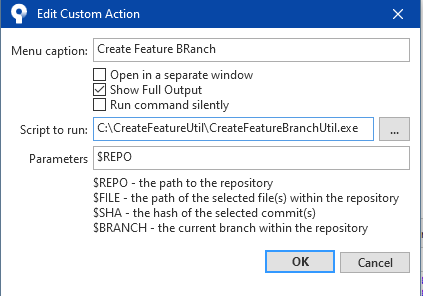
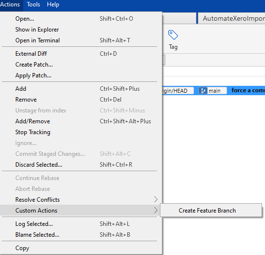
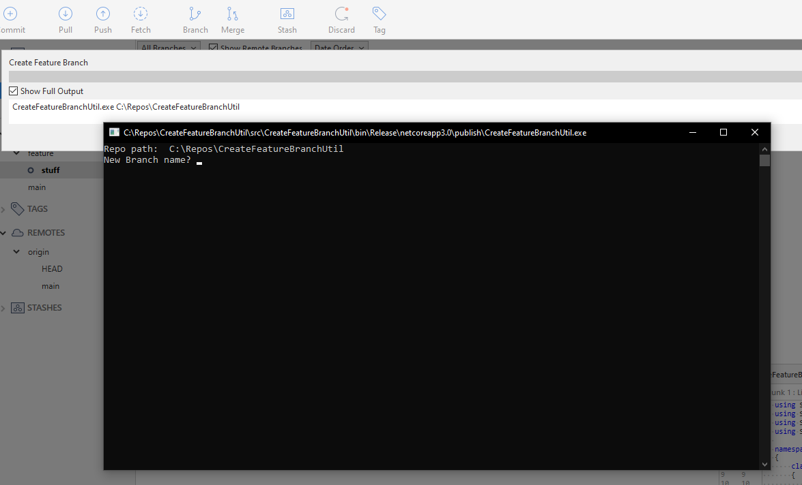
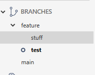

# Create Feature Branch Util
[](https://github.com/rpbeukes/CreateFeatureBranchUtil/actions?query=branch%3Amain+) [](https://github.com/rpbeukes/CreateFeatureBranchUtil/pulse/monthly)  

## Why?
Repo structure will look like this:

```
- main
- feature/branchFromMain    
- feature/newBranch
```

In [SourceTree](https://www.sourcetreeapp.com/) it will look like a directory structure which can be collapse/expanded:
```
----main
+----feature
------------branchFromMain
------------newBranch
```

SourceTree Workflow to create a new branch...
- click on the `featue/branchFromMain` branch 
- right click and click rename
- then copy the branch structure - 'feature/branchFromMain'
- click on branch
- paste copied branch name ('feature/branchFromMain) in the textbox
- delete 'branchFromMain' and entre new branch name - 'feature/newBranch'

Would like SourceTree to do all the work, so this small utility tool was created in `dotnetcore` which SourceTree will execute via `Custom Actions`.

## How to use it
Download the EXE from the [build pipeline](https://github.com/rpbeukes/CreateFeatureBranchUtil/actions?query=branch%3Amain+) (sign-in to github), and add it as a Customer Action in SourceTree.

In SourceTree, goto `Tools` > `Options` > `Custom Actions`.


Click `Add` button and...



To execute the new Custom Action, goto `Actions` > `Custom Actions` > `Create Feature Branch`



The utility will run...



Here is an example of a branch `test`, which was branched from `stuff`.



## Lastly

Use it…don’t use it :smile:
